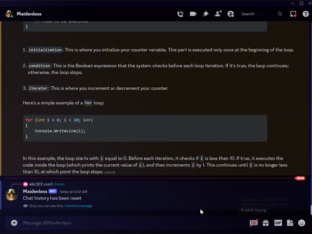

# Discord AI Chatbot 

This project adheres to the OOP and MVC principles as a practice for my study and was made for my discord server. You are allowed to switch between several models seamlessly (with shared context) and see the bot gradually generating messages as you would on ChatGPT's website. Unlike other popular discord bots, this project uses multithreading and has a thread pool with appropriate resource management for border and more efficient support of models that don't support async (There are libs that use multithreading to emulate async, yet they are not efficient enough and synchronization issues caused by this are usually not properly addressed, so I decided to use multithreading instead of async for better performance and flexibility). This project also implements a permission system that allows you to manage who can use which models.

## Supported AI Models
This project supports several AI models, including:
* Google Bard
* Google Palm2
* GPT-4 - Poe AI
* GPT-3.5 - Poe AI
* GPT-4 - Official API
* GPT-3.5 - Official API
* GPT-4 - Website Version
* GPT-3.5 Website Version
* Claude
* Claude2
All AI classes implement a common interface, so you can simply implement the interface should you ever want to add models yourself.

## Features
* **Streamed Messages:** The Discord AI Chatbot is designed to gradually generate messages. This means that users can watch the AI construct its responses in real time, creating a more interactive and dynamic interaction.
* **Multi-Model Support:** This bot can be configured to use various AI models. This feature allows users to choose the model that best suits their needs. 
* **Easy Integration:** The Discord AI Chatbot can be easily integrated into any Discord server and configured according to the server's specific requirements.

## Installation & Usage
Please follow the steps below to install and use the Discord AI Chatbot:
```bash
# Clone the repository
git clone https://github.com/naruto716/Discord-AI-Chatbot.git

# Navigate into the cloned directory
cd Discord-AI-Chatbot

# Install required dependencies
pip install -r requirements.txt

# Configure your bot's token and preferred AI model in the config.json file

# Run the bot
python bot.py
```
## Configuration
Go to Config.py and fill in your tokens. 
Please refer to:
https://github.com/ading2210/poe-api
https://github.com/acheong08/Bard
https://github.com/acheong08/ChatGPT
for methods of finding corresponding tokens.

## Contributing
Contributions to this project are welcome! Whether it's reporting bugs, suggesting enhancements, or contributing code, your help is appreciated. Please make sure to read the [Contributing Guidelines](CONTRIBUTING.md) before making a pull request.

## License
This project is licensed under the [MIT License](LICENSE.md).
